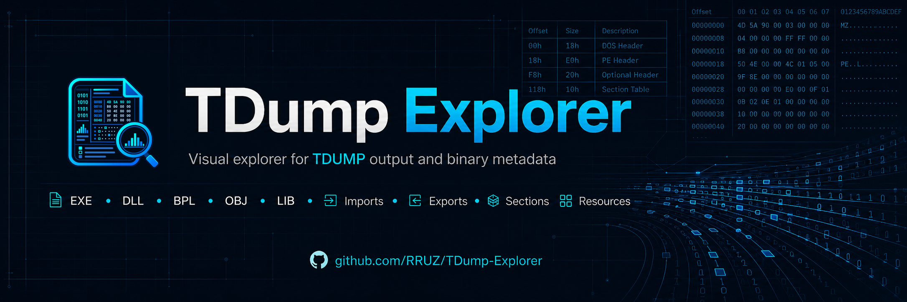
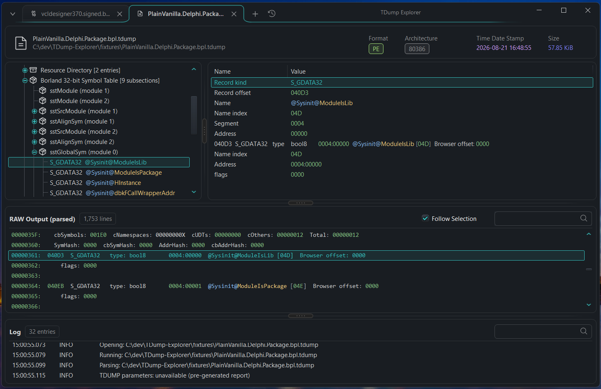
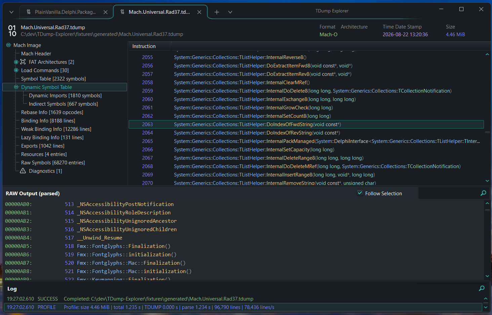
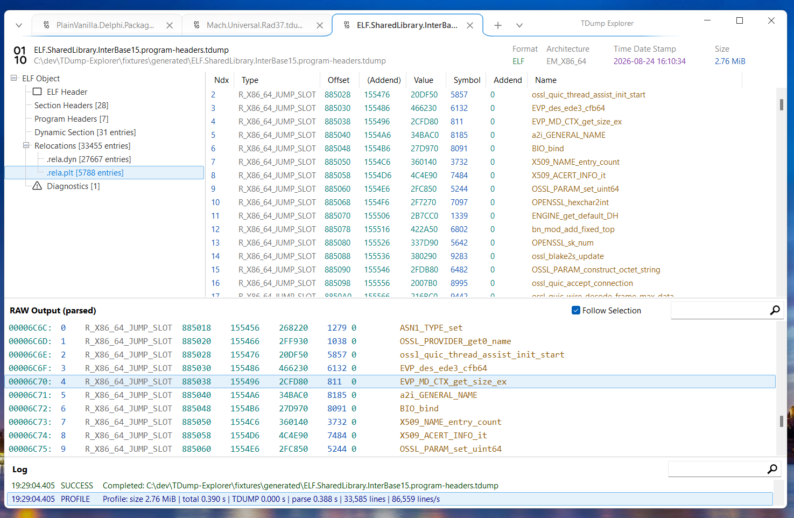

<p align="center">
  
</p>

<h1 align="center">TDump Explorer</h1>

<p align="center">
  A native Windows explorer for Embarcadero <code>TDUMP</code> and <code>TDUMP64</code> reports.
</p>

<p align="center">
  
  
  <a href="LICENSE"></a>
</p>

<p align="center">
  <a href="https://github.com/RRUZ/TDump-Explorer/releases">Releases</a> ·
  <a href="#quick-start">Quick start</a> ·
  <a href="#build-from-source">Build from source</a>
</p>

TDump Explorer turns textual dump output into navigable trees and tables while keeping the original report available for verification. Open a binary or an existing `.tdump` report and inspect PE, ELF, Mach-O, OMF, archive, and Borland debug metadata without searching through thousands of lines of text.

It is designed for build debugging, package inspection, and first-pass binary triage.

<p align="center">
  
  <br/>
  <sub>Borland debug symbols with the corresponding raw TDUMP output kept in view.</sub>
</p>

## Availability

The source code is available in this repository. Packaged builds, when published, will be listed on the [Releases](https://github.com/RRUZ/TDump-Explorer/releases) page.

## Why TDump Explorer?

- **Navigate instead of searching.** Browse headers, sections, imports, exports, resources, relocations, symbols, source modules, and diagnostics as structured trees and tables.
- **Verify the interpretation.** Structured selections can follow their corresponding ranges in the original TDUMP report.
- **Work with large reports.** Memory-mapped input, indexed lines, lazy decoding, virtualized rows, and background filtering are designed to keep the interface responsive.
- **Use a native Windows workflow.** Drag and drop, multi-document tabs, recent files, system/light/dark themes, and per-monitor DPI awareness are built into the desktop UI.

## Typical uses

- Diagnose unexpected imports, exports, sections, resources, and loader metadata.
- Inspect Delphi and C++Builder packages, source modules, symbols, and Borland debug records.
- Review architecture, timestamps, dynamic metadata, and relocation information.
- Perform first-pass inspection of an executable or library before moving to a debugger or disassembler.
- Compare structured results with the exact TDUMP text that produced them.

## Analysis coverage

| Format or data | Available views |
| --- | --- |
| PE | DOS and PE headers, data directories, sections, imports, delayed imports, exports, resources, and base relocations |
| Borland debug information | Subsection directories, source modules and files, aligned symbols, global symbols, and global types |
| ELF | Headers, sections, program headers, symbols, dynamic entries, and relocations grouped by source section |
| Mach-O | Architectures, load commands, sections, symbols, dynamic-symbol metadata, imports, binding data, and indirect symbols |
| OMF and AR archives | Record, member, and archive symbol views |
| Diagnostics and source report | Parser diagnostics plus a virtualized, syntax-highlighted RAW view with filtering and optional selection synchronization |

## Interface

<table>
  <tr>
    <td width="50%" valign="top">
      
      <br/><sub>Large Mach-O symbol and binding tables in the dark theme.</sub>
    </td>
    <td width="50%" valign="top">
      
      <br/><sub>ELF relocation analysis in the light theme.</sub>
    </td>
  </tr>
</table>

## Quick start

1. Open a generated `.tdump` report, drag it onto the application, or pass its path on the command line.
2. To inspect a binary, open or drop the file. TDump Explorer locates an installed `tdump.exe` or `tdump64.exe` and selects the appropriate tool.
3. Navigate the structured tree and select a node to populate its detail view.
4. Use the RAW panel to filter the original report and, when useful, enable selection following.

> [!NOTE]
> Opening an existing `.tdump` or compatible text report does not require TDUMP to be installed. TDUMP is required only when generating a report from a binary.

Multiple files selected in the Open dialog or dropped together are queued and analyzed one at a time. Each completed document opens in its own tab, while the activity log records tool parameters, exit status, diagnostics, and timing.

## Recognized input

TDump Explorer recognizes pre-generated TDUMP reports (`.tdump` and compatible text reports) and the following binary extensions:

| Category | Extensions |
| --- | --- |
| Windows executables and packages | `.exe`, `.dll`, `.bpl`, `.dpl`, `.ocx`, `.cpl`, `.scr`, `.com`, `.sys` |
| Objects and libraries | `.obj`, `.o`, `.lib`, `.ar`, `.a` |
| ELF and Mach-O | `.elf`, `.so`, `.dylib`, `.bundle`, `.mach` |
| Delphi units | `.dcu` |

Recognizing an extension does not guarantee that every installed TDUMP version can produce the same report. Actual coverage depends on the output emitted by the selected TDUMP utility. COFF and Delphi-unit input currently use diagnostics or fallback projections when TDUMP cannot emit a normal structured report.

## How it works

```text
binary file ──> TDUMP / TDUMP64 ──> temporary report ─┐
                                                      ├─> mapped text source ─> parser ─> document tab
.tdump report ────────────────────────────────────────┘
```

## Requirements

- An installed Embarcadero RAD Studio or Delphi toolchain providing `tdump.exe` or `tdump64.exe` when analyzing binaries.


## License

TDump Explorer is licensed under the [MIT License](LICENSE).
